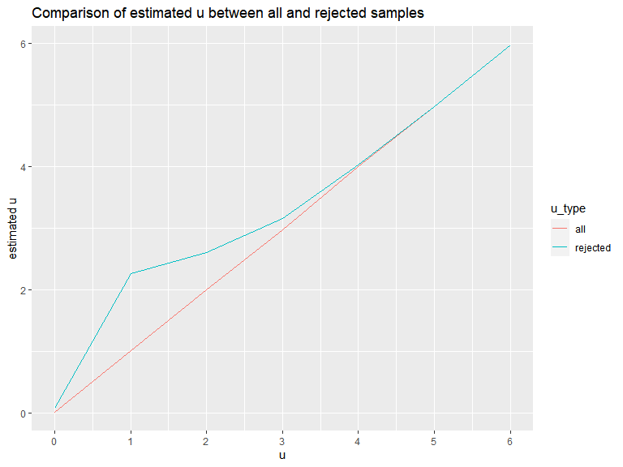

p8105_hw5_zj2357
================
Zekai Jin
2022-11-14

First of all, we should include the libraries we are using and prepare
the dataset.

``` r
library(tidyverse)
knitr::opts_chunk$set(
  message  = FALSE,
  warning = FALSE,
  fig.width = 8, 
  fig.height = 6,
  out.width = "90%"
)
```

# Problem 1

read and tidy the data

``` r
f_names = list.files("data", pattern = "(exp|con)_\\d\\d.csv")

joined_df = 
  map_dfr(str_c("data/",f_names),read_csv) %>%
  mutate(
    id = str_replace(f_names, ".csv", ""),
    group = as.factor(str_replace(f_names, "_\\d\\d.csv", ""))
  ) %>%
  select(id, group, everything()) 

write_csv(joined_df, "data/tidy/result.csv")
```

Making a spaghetti plot

``` r
joined_df %>%
  pivot_longer(
    week_1:week_8,
    names_to = "week",
    names_prefix = "week_",
    values_to = "value"
  ) %>%
  mutate(week = as.numeric(week)) %>%
  ggplot(aes(x = week,y = value, color = group, group = id)) +
  geom_line()
```


According to the plot, the observation of the experiment arm was similar
to the control arm in week 1. However, as time goes by, their value
gradually increased, and became higher than all individuals in the
control arm.

# Problem 2

Loading the dataset and summarize the crime cases over city.

``` r
rm(list = ls())

homi_df = 
  read_csv("data/homicide-data.csv") %>%
  mutate(
    city_state = str_c(city, ",", state) 
  ) %>%
  group_by(city_state) %>%
  summarise(
    n_obs = n(),
    unsolved = sum(disposition %in% c("Closed without arrest","Open/No arrest"))
  )
```

Analyze the proportion of unsolved crimes in `Baltimore,MD`.

``` r
homi_filt = filter(homi_df,city_state == "Baltimore,MD")
test_res =  prop.test(x = homi_filt$unsolved, n = homi_filt$n_obs)
save(test_res, file = "results/prop_test_BMD.RData")
broom::tidy(test_res) %>%
  select(estimate, conf.low,conf.high)
```

    ## # A tibble: 1 × 3
    ##   estimate conf.low conf.high
    ##      <dbl>    <dbl>     <dbl>
    ## 1    0.646    0.628     0.663

Thus, about 64.6% of crimes of `Baltimore,MD` are not solved. The 95%
Confidence Interval is \[62.8%, 66.3%\].

Then, run the process for all cities in `city_state` using `map_df()`:

``` r
conf_int =
  map2_df(.x = homi_df$unsolved, .y = homi_df$n_obs, .f =  ~broom::tidy(prop.test(.x,.y))) %>%
  mutate(city_state = homi_df$city_state) %>%
  select(city_state, estimate, conf.low,conf.high)

conf_int
```

    ## # A tibble: 51 × 4
    ##    city_state     estimate conf.low conf.high
    ##    <chr>             <dbl>    <dbl>     <dbl>
    ##  1 Albuquerque,NM    0.386    0.337     0.438
    ##  2 Atlanta,GA        0.383    0.353     0.415
    ##  3 Baltimore,MD      0.646    0.628     0.663
    ##  4 Baton Rouge,LA    0.462    0.414     0.511
    ##  5 Birmingham,AL     0.434    0.399     0.469
    ##  6 Boston,MA         0.505    0.465     0.545
    ##  7 Buffalo,NY        0.612    0.569     0.654
    ##  8 Charlotte,NC      0.300    0.266     0.336
    ##  9 Chicago,IL        0.736    0.724     0.747
    ## 10 Cincinnati,OH     0.445    0.408     0.483
    ## # … with 41 more rows

Sort the cities by estimated proportion, and then make a plot:

``` r
conf_int %>%
  mutate(
    city_state = fct_reorder(city_state, -estimate)
  ) %>%
  ggplot(aes(x = estimate, y = city_state)) +
  geom_point() +
  geom_errorbar(aes(xmin = conf.low, xmax = conf.high)) +
  scale_x_continuous(labels = scales::percent_format(scale = 100)) +
  labs(title = "Percentage of Unsolved Crimes across Cities")
```


Obviously, `Chicago,IL` has the highest proportion of unsolved crimes.
However, because `Tulsa, AL` has only one crime and it is solved, the
Confidence Interval is \[0, 1\], which makes no prediction power.

# Problem 3

Create a function that generates `n_sample` number of samples with
parameter `u`, `sigma` and `n`.

``` r
rm(list = ls())

prop_rej <- function(u = 0, sigma = 5, n = 30, n_sample = 5000){
  dataset = map(.x = rep(u, n_sample), .f = ~tibble(data=rnorm(n,.x,sigma))) %>%
    map(t.test) %>%
    map_df(broom::tidy)

  p_rej = dataset %>%
    filter(p.value < 0.05) %>%
    nrow() %>%
    `/`(n_sample)

  u_est = dataset %>%
    pull(estimate) %>%
    mean()
  
  u_rej = dataset %>%
    filter(p.value < 0.05) %>%
    pull(estimate) %>%
    mean()
  
  tibble(u = u, p_rej = p_rej, u_est = u_est, u_rej = u_rej)
}
```

Iterating the function for $u=\{0,1,2,3,4,5,6\}$:

``` r
exp_res = 
  0:6 %>%
  map_df(prop_rej)

exp_res
```

    ## # A tibble: 7 × 4
    ##       u p_rej   u_est  u_rej
    ##   <int> <dbl>   <dbl>  <dbl>
    ## 1     0 0.046 -0.0172 -0.199
    ## 2     1 0.186  1.01    2.24 
    ## 3     2 0.551  1.99    2.62 
    ## 4     3 0.897  3.00    3.18 
    ## 5     4 0.988  4.01    4.04 
    ## 6     5 1      5.02    5.02 
    ## 7     6 1      6.00    6.00

Then, make a plot for the percentage of samples where null was rejected
$(p<0.05)$.

``` r
exp_res %>%
  ggplot(aes(x=u,y=p_rej)) +
  geom_line() +
  scale_y_continuous(labels = scales::percent_format(scale = 100)) +
  scale_x_continuous(breaks = 0:6)+
  ylab("percentage of rejection")+
  labs(title = "Percentage of Rejection over Different u")
```


Obviously, with the increase of $u$, the power of the test increased
quickly, and saturated at about $u=5$. It is also notable that when
$u=0$, the percentage of rejection is not the power of the test, but the
percentage of type-I error, because the null hypothesis is true.

Finally, make a plot showing the comparison of $\hat{u}$ between all and
rejected samples.

``` r
exp_res %>%
  pivot_longer(
    u_est:u_rej,
    names_to = "u_type",
    values_to = "u_est"
  ) %>%
  ggplot(aes(x=u,y=u_est, color = u_type)) +
  geom_line() +
  scale_color_discrete(labels = c("all", "rejected"))+
  scale_x_continuous(breaks = 0:6)+
  ylab("estimated u")+
  labs(title = "Comparison of estimated u between all and rejected samples")
```



Because the number of rejected samples is low when $u=0$, the
$\hat{u}_{rej}$ is quite unstable around 0.

For $u \in \{1,2,3,4,5,6\}$, $\hat{u}_{rej}>\hat{u}_{all}$. However, the
gap $\hat{u}_{rej}-\hat{u}_{all}$ gradualy decreases with the increase
of $u$. Because when $u \geq 5$, nearly all samples are rejected,
$\hat{u}_{rej} \approx \hat{u}_{all}$ under such conditions.
